# NextHire

An AI-powered job application and interview preparation platform built with Next.js, Firebase, and Google Gemini AI.

## Features

- **Job Tracking** - Manage and organize your job applications in one place
- **AI Mock Interviews** - Practice with AI-powered voice interviews using Vapi AI
  - Behavioral, technical, or mixed interview types
  - Real-time voice conversations with AI interviewer
  - Detailed feedback and performance analysis after each session
- **Technical Tests** - AI-generated coding challenges tailored to job requirements
  - Customizable difficulty and question count
  - Automated evaluation and scoring
- **Resume Optimizer** - Upload your resume and get AI-powered suggestions to improve it for specific job descriptions

### Authentication

| |
|:---:|
| 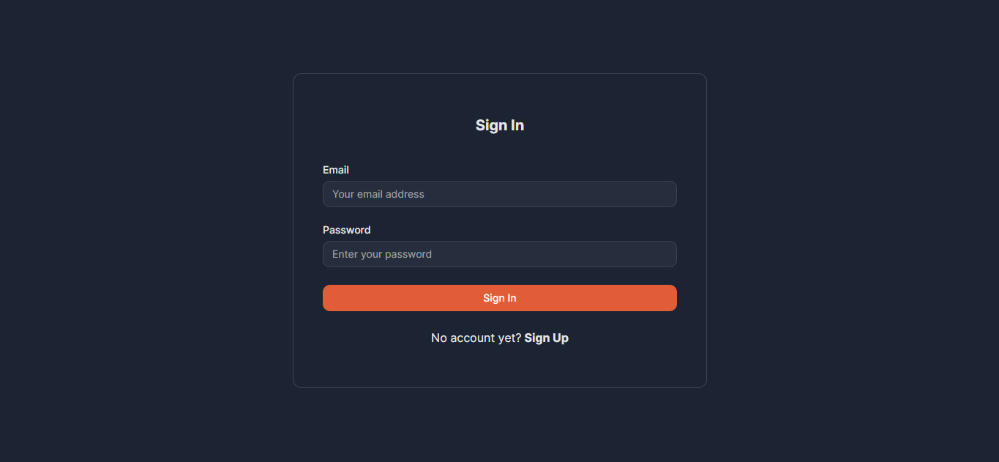 |

### Job Management

| | |
|:---:|:---:|
| 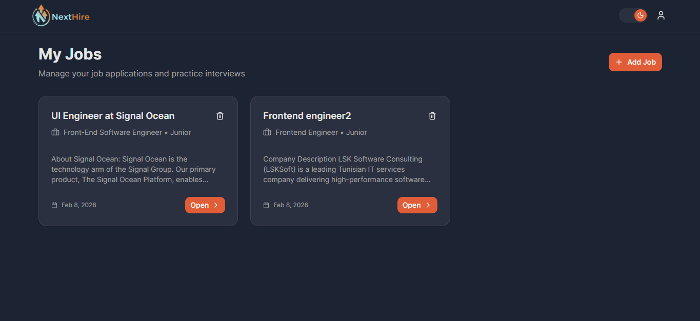 | 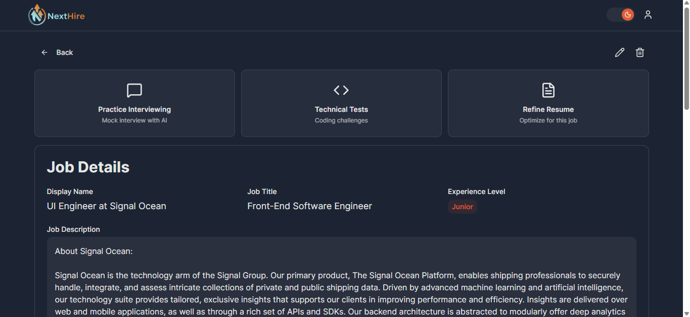 |

### AI Mock Interviews

| | | |
|:---:|:---:|:---:|
| 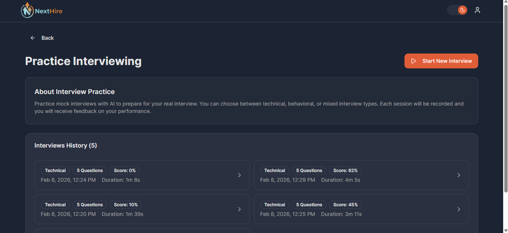 | 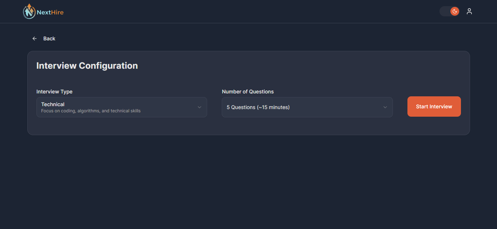 | 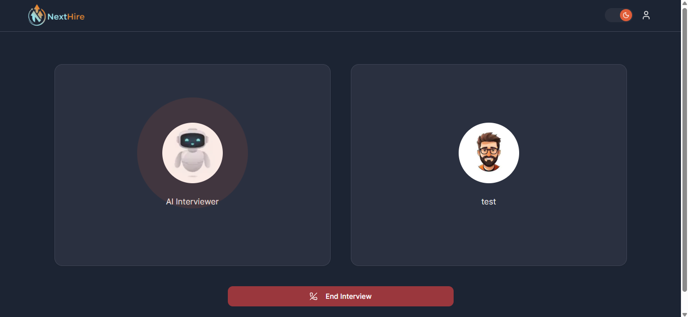 |
| 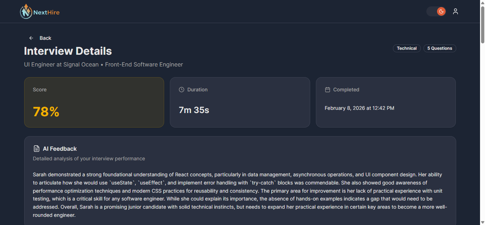 | 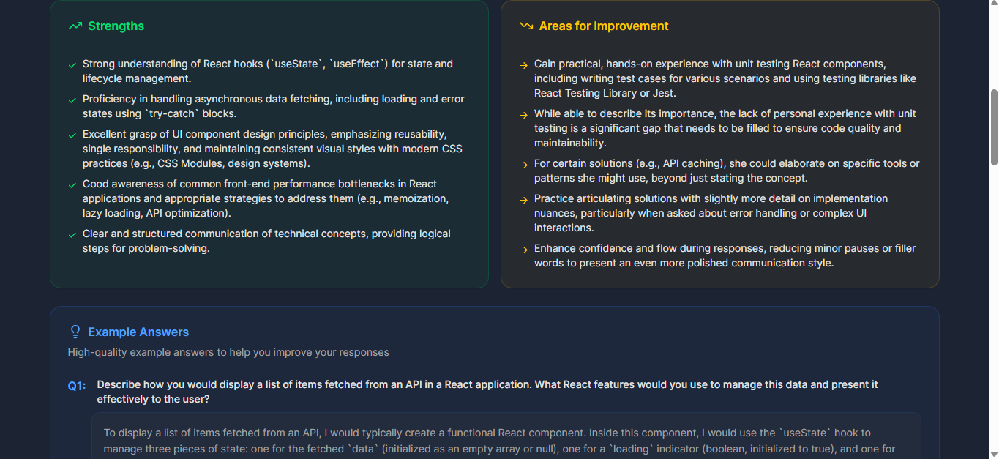 | |

### Technical Tests

| | | |
|:---:|:---:|:---:|
| 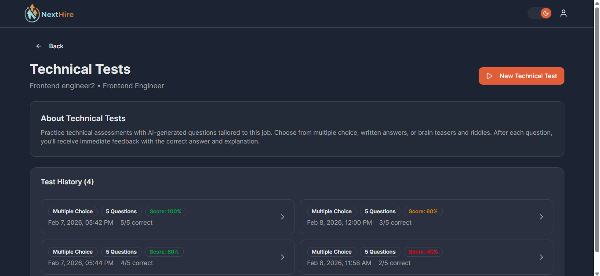 | 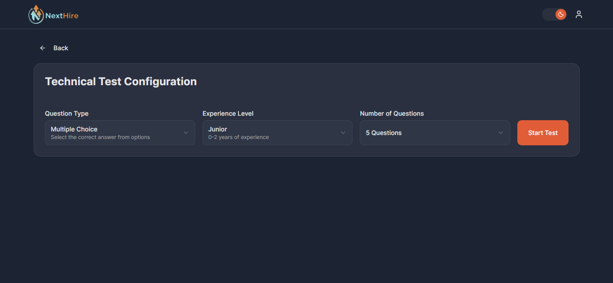 | 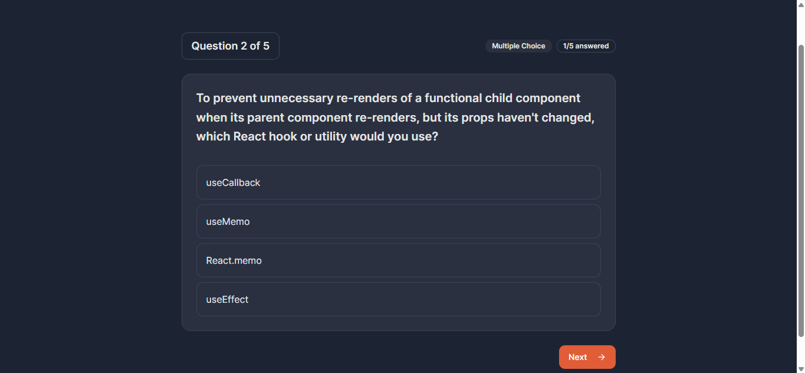 |
| 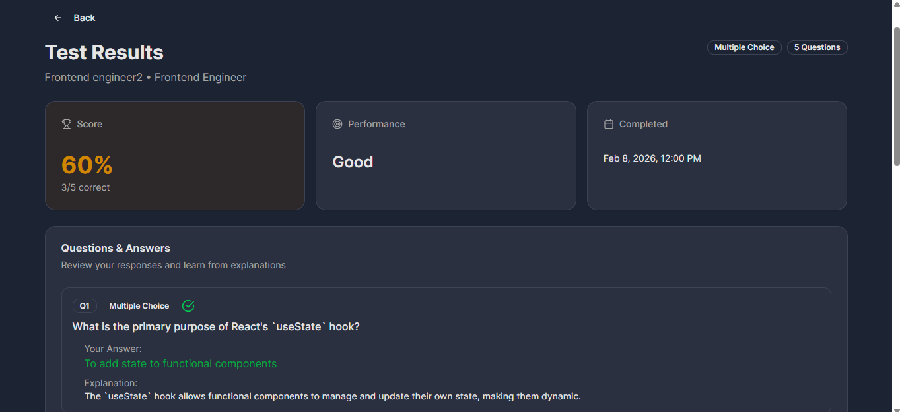 | | |

### Resume Optimizer

| | | |
|:---:|:---:|:---:|
| 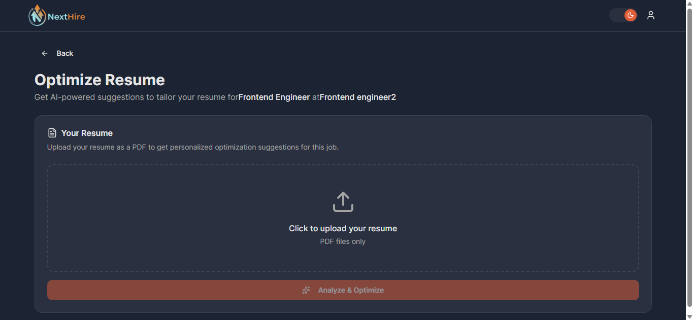 | 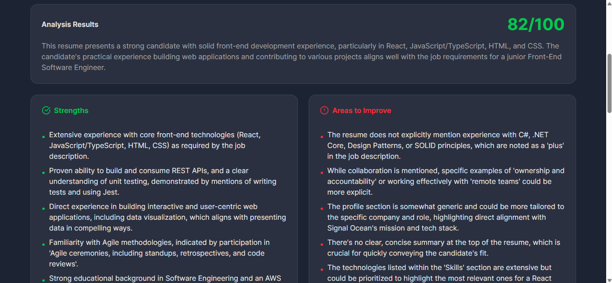 | 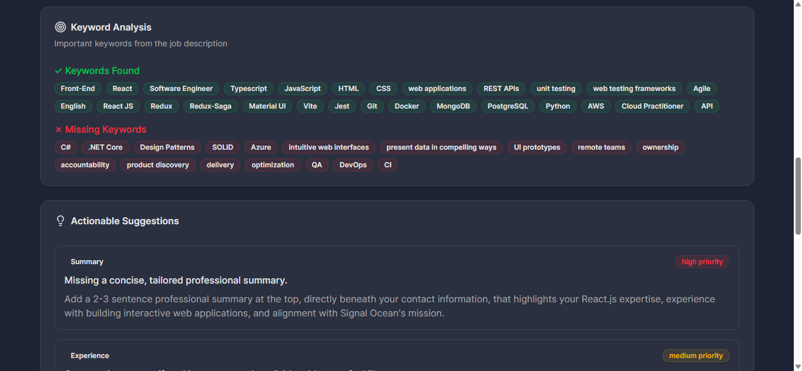 |
## Tech Stack

- **Framework**: Next.js
- **Language**: TypeScript
- **Styling**: Tailwind CSS
- **UI Components**: shadcn/ui
- **Authentication**: Firebase Auth
- **Database**: Firebase Firestore
- **AI**: Google Gemini AI (via AI SDK)
- **Voice AI**: Vapi AI for mock interviews

## Getting Started

### Prerequisites

- Node.js 18+
- pnpm (recommended) or npm
- Firebase project
- Google AI API key
- Vapi AI account

### Environment Variables

Create a `.env.local` file in the root directory:

```env
# Firebase Client
NEXT_PUBLIC_FIREBASE_API_KEY=
NEXT_PUBLIC_FIREBASE_AUTH_DOMAIN=
NEXT_PUBLIC_FIREBASE_PROJECT_ID=
NEXT_PUBLIC_FIREBASE_STORAGE_BUCKET=
NEXT_PUBLIC_FIREBASE_MESSAGING_SENDER_ID=
NEXT_PUBLIC_FIREBASE_APP_ID=
NEXT_PUBLIC_FIREBASE_MEASUREMENT_ID=

# Firebase Admin
FIREBASE_PROJECT_ID=
FIREBASE_CLIENT_EMAIL=
FIREBASE_PRIVATE_KEY=

# Google AI
GOOGLE_GENERATIVE_AI_API_KEY=

# Vapi AI
NEXT_PUBLIC_VAPI_PUBLIC_KEY=
```

### Installation

```bash
# Install dependencies
pnpm install

# Run development server
pnpm dev
```
